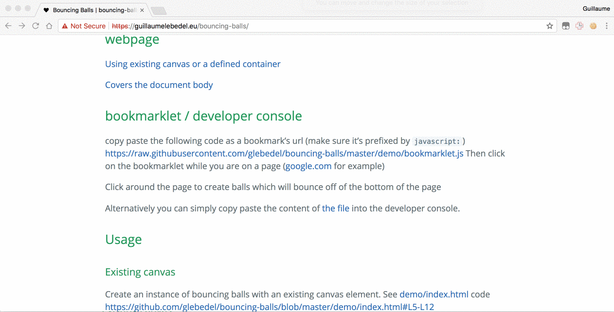

# Bouncing Balls

## Demos

## webpage

[Using existing canvas or a defined container](http://htmlpreview.github.com/?https://github.com/glebedel/bouncing-balls/blob/master/demo/index.html)

[Covers the document body](http://htmlpreview.github.com/?https://github.com/glebedel/bouncing-balls/blob/master/demo/fullscreen.html)

## bookmarklet / developer console

copy paste the following code as a bookmark's url (make sure it's prefixed by `javascript:`)
[https://raw.githubusercontent.com/glebedel/bouncing-balls/master/demo/bookmarklet.js](https://raw.githubusercontent.com/glebedel/bouncing-balls/master/demo/bookmarklet.js)
Then click on the bookmarklet while you are on a page ([google.com](www.google.com) for example)

Click around the page to create balls which will bounce off of the bottom of the page

Alternatively you can simply copy paste the content of [the file](https://raw.githubusercontent.com/glebedel/bouncing-balls/master/demo/bookmarklet.js) into the developer console.

## Usage

### Existing canvas

Create an instance of bouncing balls with an existing canvas element. See [demo/index.html](<>) code <https://github.com/glebedel/bouncing-balls/blob/master/demo/index.html#L5-L12>

```html
<body>
  <script src="../dist/bouncingballs.js"></script>
  <canvas id="bb-canvas" width="600px" height="400px" style="border: 1px solid black"></canvas>
</body>
```

```javascript
var bb = new BouncingBalls({ canvas: document.getElementById("bb-canvas") });
```

This will use the bassed canvas element as the BouncingBall play ground. By default balls are created on click (see [Bouncing Balls constructor parameter](#bouncingBalls)).

### Without specified canvas but in a container

Create an instance of bouncing balls with an existing canvas element. See [demo/index.html](<>) code <https://github.com/glebedel/bouncing-balls/blob/master/demo/index.html#L15-L20>

```html
<body>
  <script src="../dist/bouncingballs.js"></script>
    <div id="bb-container" style="width:600px;height:400px;border: 1px solid blue"></div>
</body>
```

```javascript
var bb = new BouncingBalls({
	container: document.getElementById("bb-container")
});
```

### Manually add a ball

```javascript
bb.addBall(); // creates a ball at the top left of the canvas and start drawing loop with a random x/y (-1 to 1) velocity (random starting direction)
```

```javascript
bb.addBall({ x: 50, y: 50 }); // creates a ball at coordinates 50,50 within canvas with a random x/y (-1 to 1) velocity (random starting direction)
```

### Play with parameters

Initialise BouncingBall area with very slow speed (default is 5)

```javascript
var bb = new BouncingBalls(
	{ container: document.getElementById("bb-container") },
	{ speed: 1 } // 5 times slower
);
```

If the BouncingBalls instance is already created, you can directly edit the speed property

```javascript
var bb = new BouncingBalls({
	container: document.getElementById("bb-container")
});
bb.speed = 15; // 3 times faster
```

### Stop/resume drawing loop

```javascript
bb.stop(); // stops the drawing loop (freezes the animation)
```

```javascript
bb.start(); // starts/resume the drawing loop (unfreeze the animation)
```

## Tools

### Grumbler

Gumbler boilerplate used (A template for writing distributable javascript libraries.): <https://medium.com/@bluepnume/introducing-grumbler-an-opinionated-javascript-module-template-612245e06d00>

### Launching localhosted demos

```bash
npm install
npm run webpack -- --watch
```

in another terminal:

```bash
http-server .
```

Go to [http://localhost:8080/demo/index.html](<>) or [http://localhost:8080/demo/index.html](<>) in your browser of choice.

#### Building

```bash
npm run build
```

#### Tests

-   Edit tests in `./test/tests`
-   Run the tests:

    ```bash
    npm run test
    ```

#### Testing with different/multiple browsers

```bash
npm run karma -- --browser=PhantomJS
npm run karma -- --browser=Chrome
npm run karma -- --browser=Safari
npm run karma -- --browser=Firefox
npm run karma -- --browser=PhantomJS,Chrome,Safari,Firefox
```

#### Keeping the browser open after tests

```bash
npm run karma -- --browser=Chrome --keep-open
```

# API

<!-- Generated by documentation.js. Update this documentation by updating the source code. -->

### Table of Contents

-   [Ball](#ball)
    -   [getNextPos](#getnextpos)
    -   [setPos](#setpos)
    -   [aggregateForces](#aggregateforces)
    -   [decayForces](#decayforces)
    -   [moveNext](#movenext)
-   [BouncingBalls](#bouncingballs)
    -   [drawBall](#drawball)
    -   [isDrawing](#isdrawing)
    -   [stop](#stop)
    -   [start](#start)
    -   [moveBall](#moveball)
    -   [addBall](#addball)
    -   [draw](#draw)
    -   [ballMouseHandler](#ballmousehandler)

## Ball

### getNextPos

Get the next coordinates of the ball based on current position and forces

Returns **Coordinates** x/y coordinates

### setPos

reset the ball position

**Parameters**

-   `position` **Coordinates** new coordinates where the ball must be set to

### aggregateForces

Sum up all x/y translations based on x/y components of each force

Returns **Coordinates** x/y object reflecting summed up translations

### decayForces

apply the decay ratio of each force to their x/y components

### moveNext

Move the ball to the next coordinates.
Also apply the decay ratio to each force (see [Ball~decayForces](Ball~decayForces)) after setting new coordinates

**Parameters**

-   `nextPos` **Coordinates** coordinates to move the ball to. Uses [Ball~setPos](Ball~setPos) (optional, default `this.getNextPos()`)

Returns **Coordinates** the new coordinates where the ball has been moved to

## BouncingBalls

**Parameters**

-   `$0` **any**  (optional, default `{}`)
    -   `$0.canvas`   (optional, default `window.document.createElement("canvas")`)
    -   `$0.container`   (optional, default `window.document.body`)
-   `$1` **any**  (optional, default `{}`)
    -   `$1.gravity`   (optional, default `1`)
    -   `$1.speed`   (optional, default `5`)
    -   `$1.radius`   (optional, default `10`)
    -   `$1.gravityDecayRatio`   (optional, default `1.02`)
    -   `$1.bounceDecayRatio`   (optional, default `0.965`)
    -   `$1.click`   (optional, default `true`)
    -   `$1.collisionRatio`   (optional, default `0.98`)
    -   `$1.drawInterval`   (optional, default `20`)
    -   `$1.canvasClass`   (optional, default `"bouncing-balls-canvas"`)

### drawBall

Draw ball on BouncingBalls' canvas

**Parameters**

-   `ball` **[Ball](#ball)** ball to draw

### isDrawing

Whether or not drawing loop is running

Returns **[boolean](https://developer.mozilla.org/docs/Web/JavaScript/Reference/Global_Objects/Boolean)** true if drawing loop is running / false otherwise

### stop

Stop the drawing loop

### start

start the drawing loop

Returns **TimeoutID** timeout id of the drawing loop

### moveBall

move a ball on the canvas to its next coordinates

**Parameters**

-   `ball` **[Ball](#ball)** to move on canvas

Returns **Coordinates** new coordinates where the ball has been moved to

### addBall

add a ball on the canvas

**Parameters**

-   `args` **...[Array](https://developer.mozilla.org/docs/Web/JavaScript/Reference/Global_Objects/Array)&lt;any>** 
-   `null` **any** {@see Ball}

Returns **[Ball](#ball)** ball created

### draw

draw all the BouncingBalls' balls on its canvas
If parameter is true then it launches the drawing loop

**Parameters**

-   `triggered` **[boolean](https://developer.mozilla.org/docs/Web/JavaScript/Reference/Global_Objects/Boolean)** whether or not function is being manually triggered or triggered via timeout loop (optional, default `false`)

### ballMouseHandler

Ball creation mouse handler (creating the ball based on x/y position of mouse event)

Returns **[Ball](#ball)** ball created/added to canvas
